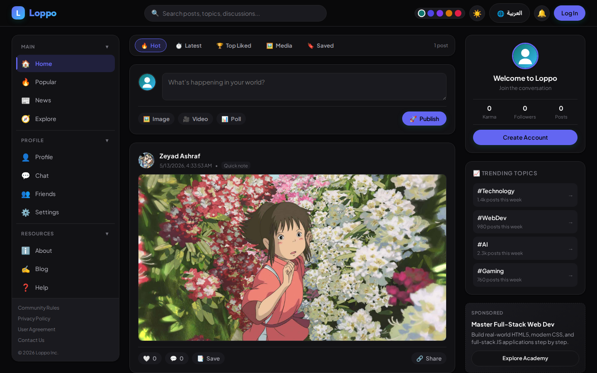
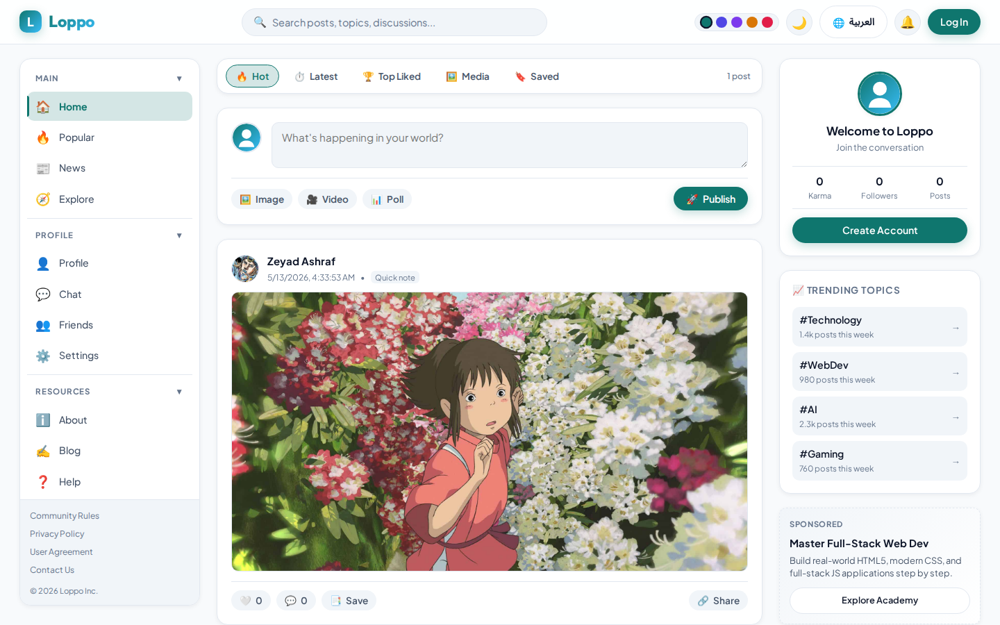

# 🌐 Loppo - Modern Social Discussion & Community Platform

[](https://nodejs.org)
[](https://expressjs.com)
[](https://supabase.com)
[](https://sqlite.org)
[](LICENSE)

Loppo is a modern, lightweight **social discussion and community platform**. Engineered with a clean, decoupled architecture, dual-mode database support (**Supabase PostgreSQL** with local SQLite fallback), native browser **Web Components** for zero-build DRY frontend layouts, and an accessible, responsive design system.

<p align="center">
  
  
</p>

---

## ✨ Features

- **🔐 Dual-Mode Auth & Storage**:
  - **Supabase Cloud**: Connects to Supabase PostgreSQL with complete Row-Level Security (RLS) policies.
  - **Zero-Setup Offline Fallback**: Automatically falls back to local SQLite when running without cloud credentials, allowing anyone to clone and test immediately.
- **🧱 Decoupled Modular Backend**:
  - Cleanly decoupled architectural layers: `src/config/`, `src/db/`, `src/routes/`, `src/middleware/`.
  - Lean `<100` line server entry point (`server.js`).
- **⚡ Native Web Components Frontend**:
  - Zero-build, dependency-free custom elements (`<loppo-header>`, `<loppo-sidebar>`, `<loppo-right-rail>`, `<loppo-post-modal>`) eliminating thousands of lines of copy-pasted HTML across 15+ pages.
- **🎨 Modern Dark/Light Design System**:
  - Obsidian & slate dark palette (`#09090b` / `#18181b`), subtle borders (`#27272a`), vibrant indigo accents (`#6366f1`), responsive mobile bottom navigation bar, and accessible focus outlines.
- **💬 Real-Time Social Core**:
  - Post feeds with hot/latest/top sorting, image & video attachments, interactive polls, nested comments, profile customization, notifications, and direct messaging.
- **🛡️ Hardened Security**:
  - Helmet headers, CORS protection, rate-limiting, bcrypt password hashing, and optional TOTP 2-Factor Authentication (`otplib` + QR code).

---

## 🏗️ Architecture

```
loppo/
├── server.js               # Lean Express application entrypoint (<100 lines)
├── package.json
├── Caddyfile               # Production reverse-proxy & auto-TLS configuration
├── .env.example            # Environment template with Supabase placeholders
├── supabase/               # Supabase Database Migrations & Schemas
│   ├── migrations/         # Timestamped SQL migrations with RLS policies
│   └── schema.sql          # Consolidated schema for Supabase SQL Editor
├── src/                    # Decoupled Backend Layers
│   ├── config/             # Environment, rate limits, and application configuration
│   ├── db/                 # Database abstraction (Supabase client + SQLite fallback)
│   ├── middleware/         # Auth verification and security middleware
│   └── routes/             # Modular Express route handlers
│       ├── auth.js         # Signup, login, 2FA, OAuth
│       ├── posts.js        # Post feeds, likes, visibility toggling
│       ├── comments.js     # Post comments & notifications
│       ├── users.js        # Profiles, follower graphs, karma
│       ├── messages.js     # Direct messaging
│       ├── notifications.js# Notification feeds & read status
│       └── admin.js        # Site-wide administration & moderation
├── js/
│   ├── components/         # Native Web Components (loppo-ui.js)
│   └── *.js                # Page-specific client-side controllers
├── css/                    # Modern design token stylesheets (style.css, sidebar.css, home.css)
└── *.html                  # Clean semantic HTML pages powered by Web Components
```

---

## 🚀 Quickstart

### 1. Clone & Install Dependencies
```bash
git clone https://github.com/lZXGl/Loppo.git
cd loppo
npm install
```

### 2. Configure Environment
```bash
cp .env.example .env
```
*(Optional)* Add your Supabase project credentials in `.env`:
```ini
SUPABASE_URL=https://your-project.supabase.co
SUPABASE_ANON_KEY=your-anon-key-here
```
> **Note**: If Supabase variables are left empty, Loppo seamlessly defaults to local SQLite storage.

### 3. Run the Development Server
```bash
npm start
```
Visit **`http://localhost:8787`** in your browser!

---

## 🗄️ Supabase Setup & Migrations

To run with Supabase PostgreSQL:
1. Create a project at [supabase.com](https://supabase.com).
2. Open the **SQL Editor** in your Supabase Dashboard.
3. Paste the contents of `supabase/schema.sql` (or run `supabase/migrations/20260921000000_init_loppo.sql`).
4. Click **Run** to set up all tables, foreign keys, triggers, and Row-Level Security (RLS) policies.
5. Copy your **Project URL** and **Anon Key** from *Project Settings -> API* into your `.env` file.

---

## 🧪 Testing & Verification

```bash
# Check syntax integrity
node --check server.js

# Run automated tests
npm test
```

---

## 📄 License

Distributed under the MIT License. See `LICENSE` for more information.